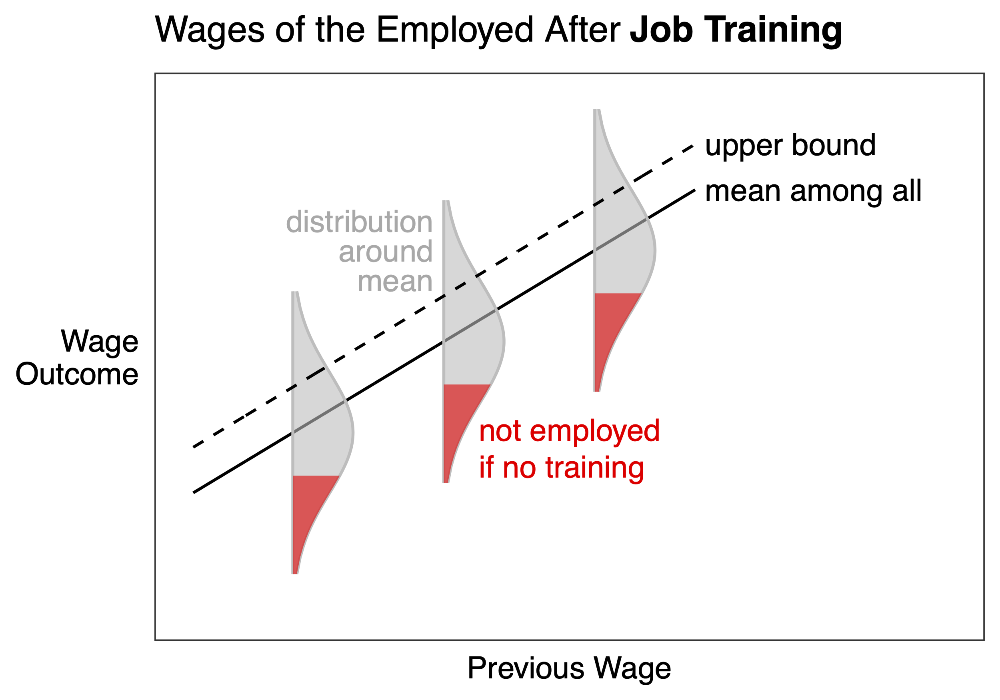

# Why regression

The goal of this package is to support parametric model-based principal stratification. This page motivates that choice: why should we want a model?

Parametric regression models make principal stratification bounds applicable in social science settings with many covariates. One such setting is causal inference in observational settings. In that setting, we might want to statistically adjust for a covariate vector $\vec{X}$.

- when $\vec{X}$ can take only a few discrete values, one can carry out principal stratification as above within each stratum of $\vec{X}$
- when $\vec{X}$ can take many values, it is possible that each vector value $\vec{X}_i$ is unique

In the latter case, we need model-based principal stratification.

1) Model the mediator
     - Fit a model for the mediator $M$
     - Estimate the probability of each stratum for each unit
2) Model the outcome
     - Fit a model for the outcome $Y\mid A = 1, M = 1, \vec{X}$
          - Example: Model the distribution of wages for employed job training recipients
     - Fit a model for the outcome $Y\mid A = 0, M = 1, \vec{X}$
          - Example: Model the distribution of wages for employed job training recipients
     - Bound by assuming that the proportion induced (from 1) is the upper or lower portion conditional on covariates

### Upper bound: Left - Right

{ width=40% }
{ width=40% }

### Lower bound: Left - Right

{ width=40% }
{ width=40% }
